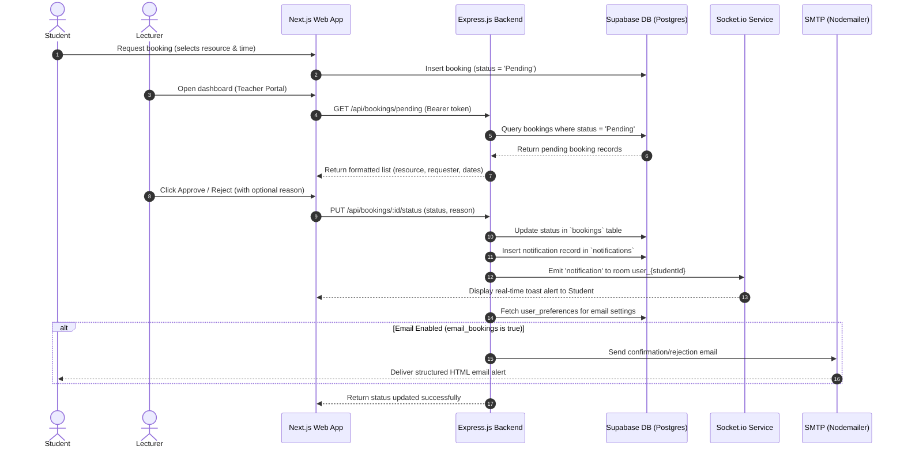

# Booking Approval Alerts & Workflow Documentation

This document describes the architectural design, database schemas, API specs, and front-end interface flows for the **Booking Approval Alerts** module of the University Resource Management System (URMS).

---

## 1. Module Overview

The Booking Approval module handles resource reservation queues. The workflow functions as follows:
1. A **Student** requests a booking for a specific available resource.
2. The booking is marked as `'Pending'` in the database and enters the approval queue.
3. A **Lecturer** or **Admin** views the request on their dashboard.
4. They can **Approve** or **Deny** (providing a reason) the request.
5. The system performs the following actions:
   - Updates the status in the `bookings` table.
   - Saves an in-app alert in the `notifications` table.
   - Emits a real-time event via **Socket.io** to the student's channel.
   - Dispatches a stylized HTML email to the student via **SMTP**, honoring the student's notification preferences.

---

## 2. System Architecture



---

## 3. Database Schema

Four core tables facilitate the booking approval workflow:

### `bookings`
Stores reservation records.
* `id` (UUID, Primary Key)
* `user_id` (UUID, Foreign Key → `users.id`)
* `resource_id` (UUID, Foreign Key → `resources.id`)
* `start_time` (TIMESTAMPTZ)
* `end_time` (TIMESTAMPTZ)
* `status` (VARCHAR, defaults to `'Pending'`; transitions to `'Approved'` or `'Rejected'`)

### `notifications`
Stores in-app alert history for notification centers.
* `id` (UUID, Primary Key)
* `user_id` (UUID, Foreign Key → `users.id`)
* `title` (VARCHAR)
* `message` (TEXT)
* `type` (VARCHAR: `'success'` | `'error'` | `'info'` | `'warning'`)
* `is_read` (BOOLEAN, defaults to `false`)
* `timestamp` (TIMESTAMPTZ, defaults to `now()`)

### `user_preferences`
Controls user-configurable notification settings.
* `user_id` (UUID, Primary Key, Foreign Key → `users.id`)
* `email_bookings` (BOOLEAN, defaults to `true`)

### `resources`
Resource definitions.
* `id` (UUID, Primary Key)
* `name` (VARCHAR)
* `department` (VARCHAR)
* `availability_status` (VARCHAR: `'Available'` | `'Maintenance'`)

---

## 4. API Endpoints

### 1. Fetch Pending Bookings
Retrieve all bookings with state `'Pending'` alongside user profile details and resource labels.

* **Endpoint**: `GET /api/bookings/pending`
* **Headers**:
  * `Authorization: Bearer <JWT_Token>`
* **Role Check**: Requires role `lecturer` or `admin`.
* **Success Response (200 OK)**:
  ```json
  {
    "status": "success",
    "data": [
      {
        "id": "b9683935-cfd6-4443-85fa-7108920556ea",
        "start_time": "2026-05-25T09:00:00.000Z",
        "end_time": "2026-05-25T11:00:00.000Z",
        "status": "Pending",
        "created_at": "2026-05-21T18:00:00.000Z",
        "resource_id": "r100...",
        "user_id": "u200...",
        "users": {
          "name": "Jane Student",
          "email": "jane@demo.lk"
        },
        "resources": {
          "name": "Advanced Robotics Lab",
          "location": "Engineering Block C"
        }
      }
    ]
  }
  ```

---

### 2. Update Booking Status
Approve or decline a booking request, saving records to in-app notifications, pushing real-time events, and emailing the user.

* **Endpoint**: `PUT /api/bookings/:id/status` / `PATCH /api/bookings/:id/status`
* **Headers**:
  * `Authorization: Bearer <JWT_Token>`
* **Role Check**: Requires role `lecturer` or `admin`.
* **Request Body**:
  ```json
  {
    "status": "Approved", // or "Rejected"
    "rejectionReason": "The lab is scheduled for deep cleaning at this hour." // Required only for Rejection
  }
  ```
* **Success Response (200 OK)**:
  ```json
  {
    "status": "success",
    "message": "booking approved successfully",
    "data": {
      "id": "b9683935-cfd6-4443-85fa-7108920556ea",
      "status": "Approved"
    }
  }
  ```

---

## 5. Communications & Notification Flow

### Real-Time WebSockets
- Express publishes event messages to the websocket namespace room `user_${targetUserId}`.
- **Event Name**: `"notification"`
- **Message Payload**:
  ```json
  {
    "id": "notif-uuid",
    "title": "Booking Approved",
    "message": "Your booking request for Advanced Robotics Lab on May 25, 2026 was approved.",
    "type": "success",
    "createdAt": "2026-05-21T18:05:00.000Z",
    "read": false
  }
  ```

### Email System
1. Query `user_preferences` for the recipient's preference record:
   - If `email_bookings` is configured to `false`, email transmission is skipped.
   - If no configuration is present or it is `true`, transmission proceeds.
2. Templates (dispatched via `nodemailer` using a custom HTML design matching the application's dark-mode/glassmorphic layout):
   - **Approved**: Dispatches `sendBookingConfirmationEmail(...)` containing resource metadata, date, and reservation slot timings.
   - **Declined**: Dispatches `sendBookingRejectionEmail(...)` containing the resource title, date, timing, and inline highlight of the `rejectionReason`.

---

## 6. Frontend Components

### 1. Booking Creation (Student Flow)
Managed within [NewBookingModal.tsx](file:///d:/SUSL/sem%2004/Capstone%202/Capstone-Group-15---URMS/components/NewBookingModal.tsx):
- Queries resources where `availability_status = 'Available'`.
- Filters dropdown items reactively when the student picks a specific Faculty.
- Presents validation alerts (e.g. End Time is after Start Time) in a crimson banner at the top of the form.
- Inserts new requests into the Supabase database with `'Pending'` status.

### 2. Approval Queue & Decline Dialog (Lecturer Flow)
Managed within the Lecturer Dashboard block of [page.tsx](file:///d:/SUSL/sem%2004/Capstone%202/Capstone-Group-15---URMS/app/dashboard/page.tsx):
- Fetches all pending bookings from `/api/bookings/pending` on mount, checking credentials with the Firebase ID token.
- Displays cards for all pending requests containing the resource, requestor, date, and time blocks.
- **Approve Action**: Makes a direct PUT request to the backend. Automatically filters out the booking on success.
- **Deny Action**: Opens a custom glassmorphic overlay modal prompting the lecturer for a text-based reason. Submitting the reason executes the PUT request, updating the backend cleanly.
